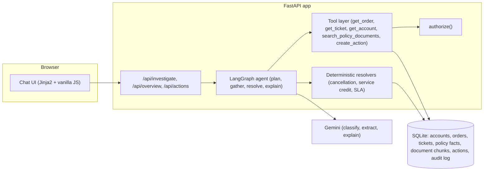

# ParcelPilot Support Operations Copilot

An internal, staff-facing AI chatbot for ParcelPilot's customer operations team, built for the CalQuity AI Engineer assessment.

A support agent (or manager) logs in as a mocked staff user and asks natural-language questions about accounts, orders, tickets, and policy. The system investigates using authorization-gated tools, applies deterministic business rules for anything that must be numerically or legally correct, and explains the answer with citations. State-changing actions (such as escalations) are prepared but never executed without explicit confirmation.

**The core principle: the AI only reads, plans, and explains. Deterministic, unit-tested Python code decides fees, credits, severity, and authorization.**

## What it does

- Answers natural-language support questions using only the supplied policy, SOP, agreement, product, and operational data.
- Handles source authority correctly: signed customer agreements override the general policy, deprecated documents are never used, historical ticket resolutions are treated as unreliable context only.
- Escalates to a human ("needs review") whenever a query requires judgment the system does not have grounds for, rather than guessing.
- Enforces access control in the tool layer, not in model instructions: a staff user can only ever reach accounts they are assigned to.
- Prepares state-changing actions (escalations) and requires an explicit confirmation step before anything is actually executed.
- Surfaces which tool ran, at each step, directly in the chat interface.
- Proactively flags SLA-risk tickets and clusters tickets against known product issues, without waiting to be asked.

## Architecture at a glance



See [`docs/ARCHITECTURE_NOTE.md`](docs/ARCHITECTURE_NOTE.md) for the full agent workflow diagram, tool design, and source-reliability handling. See [`docs/PRODUCT_NOTE.md`](docs/PRODUCT_NOTE.md) for product decisions and what was left out. See [`docs/AI_TOOL_USAGE.md`](docs/AI_TOOL_USAGE.md) for AI tool usage disclosure. See [`docs/SCALE.md`](docs/SCALE.md) for how this architecture would evolve at 100x and 1000x the current data size. See [`docs/POLICY_UPDATES.md`](docs/POLICY_UPDATES.md) for how to actually update a policy or add a vendor on a live deployment.

## Hosted demo

`<add your Render/Railway/Fly.io URL here after deploying>`

## Deploying (Render)

This repo includes `render.yaml` for a one-step deploy:

1. Push this repo to GitHub (it already includes the required `ParcelPilot_Assessment_Data.xlsx`; the 6 PDFs are intentionally excluded since nothing reads them at runtime).
2. On [Render](https://dashboard.render.com), choose **New > Blueprint**, point it at this repo, and it will pick up `render.yaml` automatically.
3. Set the `GEMINI_API_KEY` environment variable in the Render dashboard (it's declared as `sync: false` in `render.yaml` so Render prompts for it rather than reading it from a file).
4. Deploy. The database seeds itself from the committed workbook on first request, same as local.

Note: Render's free tier uses ephemeral disk, so `app/parcelpilot.db` (and in-memory conversation state) resets on redeploy or a free-tier spin-down/spin-up cycle -- fine for a demo, and consistent with the documented single-process limitation in the Product Note.

## Setup

Requirements: Python 3.12+, a Gemini API key.

```bash
python -m venv .venv
source .venv/bin/activate        # Windows: .venv\Scripts\activate
pip install -r requirements.txt
```

Create a `.env` file in the project root:

```
GEMINI_API_KEY=your-key-here
```

### Data pack

The app reads structured data and the reference timestamp from `AI Agent Assessment - Candidate Pack/ParcelPilot_Assessment_Data.xlsx` (paths are set in `app/config.py`). Place the assessment data pack (the workbook plus the 6 policy and agreement PDFs) in a folder named exactly `AI Agent Assessment - Candidate Pack/` at the project root before running. The 6 PDFs themselves are not read at runtime; see the Architecture Note for why. Only the workbook is required to start the app. The database (`app/parcelpilot.db`) is created and seeded automatically on first request.

## Run

```bash
uvicorn app.main:app --reload
```

Open `http://127.0.0.1:8000`. Use the user switcher in the top right to log in as different mocked staff users (each scoped to different accounts) or as the manager (sees everything).

## Tests

```bash
pytest                          # full suite; live-model tests skip cleanly without a key
GEMINI_API_KEY=your-key pytest  # includes live-model integration and generalization-eval tests
```

`tests/test_generalization_eval.py` is a live-model evaluation suite covering roughly 29 natural-language questions (product docs, known issues, agreements, policy, historical-ticket conflicts, ambiguous and adversarial conversation, multi-turn context) using data-pack records that are not in the assessment brief's own examples. It requires a real `GEMINI_API_KEY` and takes several minutes.

## Project layout

| Path | What it does |
|---|---|
| `app/agent.py` | LangGraph workflow: plan, then gather (tools), then resolve, then explain. |
| `app/resolvers.py` | Deterministic business-rule functions (cancellation fee, service credit, SLA risk). No AI involvement, unit-tested independently. |
| `app/tools.py` | Authorization-gated data and document lookups. |
| `app/auth.py` | Mocked staff users plus `authorize()`. |
| `app/actions.py` | Two-phase action prepare/confirm flow plus audit log. |
| `app/overview.py` | Proactive SLA-risk and issue-clustering views. |
| `app/policy_facts.py`, `app/documents.py` | Hand-verified contract facts and citation corpus. |
| `app/main.py`, `app/templates/`, `app/static/` | FastAPI app and chat UI. |
