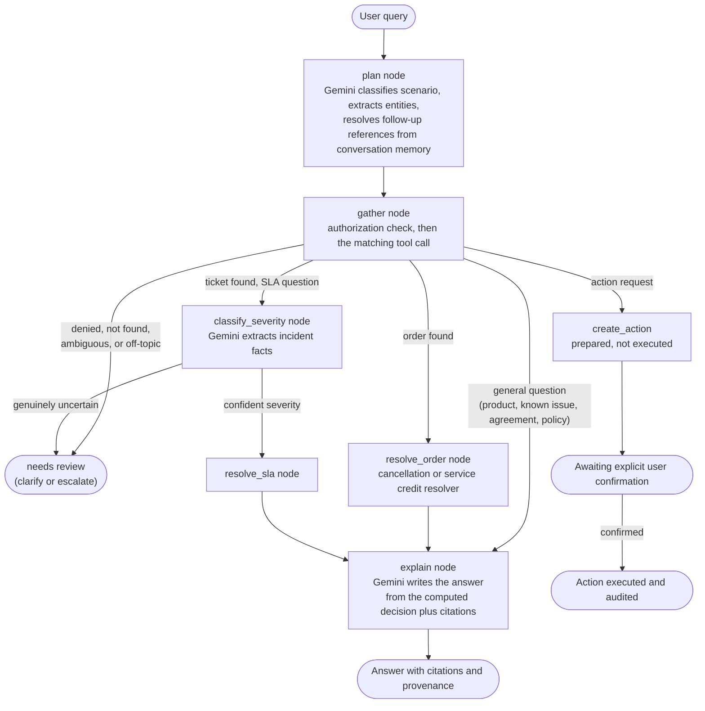
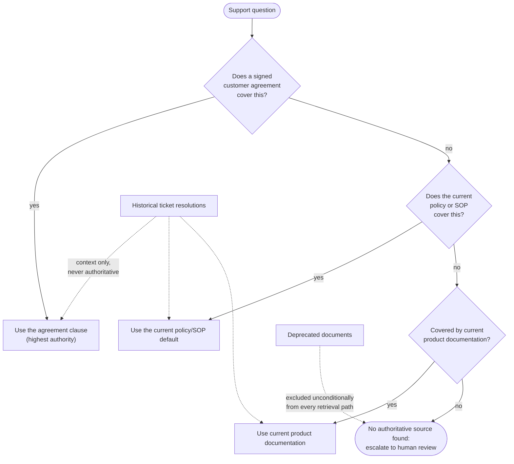

# Architecture Note: ParcelPilot Support Copilot

**In one paragraph, no jargon:** a question comes in, the system figures out what's being asked and looks up whatever it needs — an order, a ticket, the right policy text — while checking the whole time whether the person asking is actually allowed to see it. Anything that needs to be numerically or legally exact (a fee, a credit, a deadline) gets computed by a plain, tested piece of code, never guessed by the AI. Only the very last step, writing the sentence that explains the answer, is left to the AI. The rest of this document is the technical version of that same idea.

## Agent design

The agent is a LangGraph `StateGraph`: `plan` (Gemini classifies the query and extracts entities), then `gather` (deterministic tool selection and execution, authorization-gated), then conditional routing, then a domain resolver when one applies, then `explain` (Gemini writes the answer from already-computed evidence, never from its own arithmetic or policy judgment).



**Scenario classification is only used when a specialized deterministic resolver is required. It is not the definition of the chatbot's reasoning surface.** The planner classifies into `cancellation`, `service_credit`, or `sla` only when the question maps to one of those three specific calculations. Every other legitimate support question (product capability, known issues, agreement terms, general SOP or policy, ticket investigation that is not about SLA timing) falls into a single `general_inquiry` route that searches the entire authorized document corpus by keyword relevance rather than a fixed tag. `general_inquiry` is intentionally not further subdivided into per-topic categories such as `product_question` or `known_issue_question`: adding a named bucket per topic would just move the same overfitting problem up one level. The taxonomy stays fixed at one bucket per thing the system must *compute*, plus one general bucket for everything it must *retrieve and explain*.

Tool selection happens via this bounded LLM classification followed by deterministic Python routing, not open-ended function-calling with an iterative plan/act/observe loop. This is a deliberate choice, not an oversight. The system's trust boundary is that the LLM only reads, plans, and explains, while plain, unit-tested Python decides fees, credits, severity, authorization, and action execution. An iterative tool-calling loop would let the model influence which deterministic step runs and in what sequence, with less structural guarantee that every branch stays authorization-checked and resolver-backed. The bounded classification keeps that guarantee mechanical rather than relying on prompt discipline. This satisfies the requirement that the agent choose between at least three distinct tools (document retrieval, structured data lookup/calculation, state-changing action). See `tests/test_agent_golden_scenarios.py::test_materially_different_requests_select_different_bounded_capabilities`, which proves three materially different natural-language requests each select a disjoint tool set.

## Tool design

In plain terms, the agent has exactly three kinds of tools, and it's never allowed to invent a fourth kind of action on the fly: it can go look something up (a document or a record), it can run a calculation that must come out the same way every time, or it can prepare — never immediately perform — a change. All three are gated by the same authorization check, enforced in code, not by asking the model nicely.

Three tool categories, all authorization-gated in `app/tools.py` (never in the model's instructions):

1. **Document retrieval.** `search_policy_documents(conn, scenario, account_id, user, keyword=None)`. `scenario` narrows by tag when a resolver needs precision. `scenario=None` (the `general_inquiry` path) uses `_search_general_inquiry` in `app/agent.py`: it fetches the authorized, non-deprecated candidate set via `list_candidate_chunks` and asks the model to select which of those (already-authorized) chunks are actually relevant, falling back to `search_policy_documents`'s keyword-overlap ranking if the model call fails or returns something invalid. See "Document and structured-data handling" below for why and how this is bounded. Deprecated documents are always excluded. Account-specific chunks rank above global defaults.

   ```mermaid
   flowchart TD
       q(["general_inquiry question"]) --> candidates["list_candidate_chunks:\nauthorized, non-deprecated chunks\n(SQL filter, before the model sees anything)"]
       candidates --> llm{"Model judges relevance\nagainst the candidate set"}
       llm -->|"valid chunk_ids returned"| validate["Drop any id not in\nthe candidate set"]
       llm -->|"call fails / malformed output"| fallback["Deterministic keyword-overlap\nsearch (search_policy_documents)"]
       validate --> citations(["Citations passed to explain"])
       fallback --> citations
   ```

2. **Structured data lookup and calculation.** `get_order`, `get_ticket`, `get_account` (authorization-gated reads) plus `resolve_cancellation`, `resolve_service_credit`, `resolve_sla` (pure functions, zero AI involvement, unit-tested independently of any model call).
3. **State-changing action.** `create_action` (PREPARED only, audited) and `confirm_action` (PREPARED to EXECUTED, rejects a second confirmation, always audited). The agent can only ever prepare an action; nothing reaches EXECUTED without an explicit, separate user confirmation call.

## Document and structured-data handling

Documents are hand-chunked at the section level (`app/documents.py`, 19 chunks from the 6 supplied PDFs) rather than parsed at runtime. The corpus is small and fixed, so committing reviewed chunks avoids a whole class of extraction-accuracy bugs at negligible cost. Structured data (accounts, orders, tickets) loads from the supplied workbook into SQLite (`app/seed_accounts_orders_tickets.py`). Contract-specific overrides are hand-verified facts (`app/policy_facts.py`) keyed by `(account_id, scenario, fact_name)`, falling back to the global default in `app/policy_config.py` when no override exists.

**Why the global defaults live in `policy_config.py`, not as literals inside the resolvers.** `resolve_cancellation`/`resolve_service_credit`/`resolve_sla` used to have ParcelPilot's actual numbers (₹250, 30 minutes, 2-hour threshold, P1/P2/P3 targets) written directly as Python literals. Pulling them into one versioned, effective-dated config object doesn't change what's computed -- it makes "what does this system currently compute with, and as of when" a single, greppable place, which matters for two things: proving the system isn't secretly hardcoded to one company's numbers (see `docs/SCALE.md`, "porting to a different company"), and catching drift between what's cited and what's computed. `tests/test_policy_config_drift.py` mechanically extracts the same numbers out of the `app/documents.py` chunk text and asserts they match `policy_config.py` -- this exists because the two are hand-maintained separately and nothing else keeps them in sync; see `docs/SCALE.md`, "Keeping policy config in sync as the document set changes," for why that's a deliberate scope boundary rather than a gap, and how the same problem would be handled at real scale.

**Why `general_inquiry` retrieval is LLM-based selection, not keyword search, and why that's still not "vector RAG."** Keyword-overlap ranking requires literal shared words between the question and a chunk's text (`sum(w in r["text"].lower() for w in words) >= 2`). That structurally misses a paraphrase: "do we get money back" never matches a chunk that only ever says "service credit," "courier" never matches "carrier." At this corpus size (a few dozen chunks per account at most), the fix doesn't need embeddings or a vector index -- the whole authorized candidate set fits in one prompt, so `_select_chunks_llm` (`app/agent.py`) just asks the model to judge relevance directly against the text it can already see. This is deliberately bounded, not open-ended retrieval: `list_candidate_chunks` (`app/tools.py`) does authorization and deprecation-filtering in SQL *before* the model ever sees a chunk -- the model is choosing which of an already-authorized set to surface, never which accounts or documents it's allowed to look at -- and every returned `chunk_id` is validated against that same authorized set, so a hallucinated id can never smuggle in unauthorized text. If the model call fails, times out, or returns malformed JSON, retrieval falls back to the deterministic keyword search rather than surfacing an error or silently returning no evidence. This stops being the right approach once the candidate set stops fitting comfortably in one prompt (see `docs/SCALE.md` Tier 2, where hybrid lexical+vector search with a reranker becomes the right move) -- it is a corpus-size-appropriate middle step between pure keyword overlap and a real vector index, not a permanent architecture.

## Source reliability and conflict handling

In plain terms: if a customer signed a specific deal, that deal wins, always. If not, the current company-wide policy applies. If even that doesn't cover it, the product manual might. If none of the three has an answer, the system says so and asks a human, rather than guessing. Old tickets and outdated documents never get a vote, no matter how relevant they look.



- **Precedence**: signed customer agreement, then current support policy/SOP, then current product documentation, then historical tickets (context only).
- **Deprecated documents** are excluded from every retrieval path unconditionally.
- **Historical ticket resolutions** are threaded into the explanation prompt as a structurally separate block, explicitly labeled as context only that may be outdated or wrong and must never be treated as current policy. They are kept out of the `citations` list so they can never rank or read as an authoritative source.
- **Genuine uncertainty** (for example, carrier-fault status unknown) refuses to guess and routes to human review rather than picking a plausible answer.
- **Prompt injection**: user text is delimited and the model is told not to follow instructions embedded in it, but this is hardening, not the real security boundary. The real boundary is `authorize()` and the deterministic resolvers, which never take LLM output as authority for access control or calculations.

## Major technical trade-offs

- **Bounded classification over open-ended tool-calling** (see Agent design). Trust guarantees are chosen over apparent agentic sophistication.
- **Hand-chunked static corpus over runtime PDF parsing or vector search.** Appropriate at this corpus size (6 documents); would need to change if the corpus grew significantly.
- **LLM-based relevance selection over the authorized candidate set, not keyword overlap, for `general_inquiry`.** Chosen over keyword search because keyword overlap cannot match a paraphrase, and over a vector index because the whole candidate set already fits in one prompt at this size. Deterministic keyword search is kept as the fallback path, not replaced, so a model outage degrades retrieval quality rather than breaking it.
- **In-memory, per-process conversation state** (`app/conversation.py`). The simplest correct thing for a single-process deployment; documented as needing a shared store such as Redis if deployed multi-process.
- **Deterministic resolvers over letting retrieved text drive the computation directly (i.e. "just do RAG for everything"), and this holds at any scale, not just today's.** RAG's real strength -- re-embed a changed document and the next query serves the new text -- solves *serving current text*. It says nothing about whether the model, having retrieved the right text, computes the right number from it every time, and those are different failure modes. Concretely, in this exact data pack: LumenWorks' service-credit threshold is 4 hours; the default SOP threshold is 2 hours. "Pickup was 3 hours late, do I get a credit?" requires correctly recognizing the signed agreement overrides the SOP, picking 4h not 2h, and concluding *no* credit -- the opposite of the default policy alone. Asking a model to redo that precedence-and-arithmetic reasoning fresh from prose on every call has non-zero variance: reword the question and there's no guarantee it comes out the same way twice. `resolve_service_credit` makes it the same answer every time, provably, via `tests/test_resolvers_credit.py`. RAG is the right tool for finding and explaining relevant text (see the `general_inquiry` design above); it is the wrong tool for computing a financially or legally exact decision from it, and more embeddings at greater scale improve retrieval, not the model's arithmetic reliability -- which is why `app/policy_config.py` is a separate, versioned artifact from the `app/documents.py` citation chunks, rather than resolvers reading numbers out of retrieved text at answer-time. Full treatment, including how policy changes get applied at scale without becoming either an unreviewed automatic update or an unscalable manual one, in `docs/SCALE.md`.
