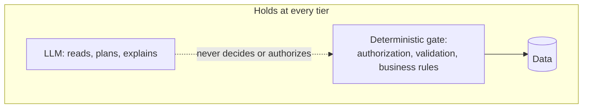
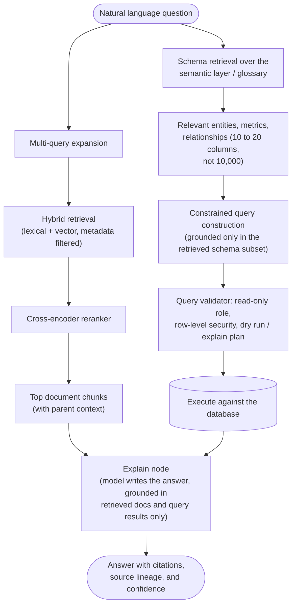

# Scale Note: how this architecture would change as data grows

This document exists because a fair question came up: the current design (a
handful of documents, a handful of tables) makes specific, deliberate
choices that are correct at this size and would stop being correct at a
much bigger one. This note walks through what changes, tier by tier, from
what is actually built today up to a scale that looks like a real
enterprise financial data platform (which is, not coincidentally, the kind
of problem CalQuity itself is building for).

Each tier has a plain language paragraph first, then the technical detail.
That mirrors how the rest of this project's own progress log is written,
and it matters here because the concepts get genuinely more complex as the
tiers go up.

## The one idea that never changes

Plain language: no matter how big the data gets, the model should never be
the thing deciding what is true or what is allowed. It reads, it plans, it
explains. Something else, code, a database constraint, a validator, always
makes the actual decision and always checks who is allowed to see what.

Technical: the trust boundary is `authorize()` plus deterministic resolvers
today. At bigger scale that boundary does not disappear, it moves closer to
the data (database-level row-level security instead of an in-app check) and
gets more layers (a schema-linking step, a query validator, a read-only
role), but the principle that the LLM never becomes the source of truth for
a decision or a permission is the one thing that should survive every tier
below.

## Tier 0: what is actually built right now

Plain language: 6 policy and agreement documents, hand read and cut into 19
labeled passages by a person. A handful of database tables: accounts,
orders, tickets, a small table of contract-specific facts, an audit log. A
support question gets its keywords pulled out, those keywords are checked
against the 19 passages for word overlap, and the two or three best matches
get handed to the model to explain. Structured lookups (an order, a ticket,
an account) run through one fixed, parameterized query per entity type,
never a query the model wrote itself.

Technical:

- **Retrieval**: lexical keyword overlap over `app/documents.py`'s 19
  hand-authored, hand-reviewed chunks. No embeddings, no vector store.
- **Ranking**: count of matching significant keywords, with a minimum
  overlap threshold so an unrelated question returns nothing rather than
  the whole corpus.
- **Structured data**: `get_order`, `get_ticket`, `get_account`, each a
  single fixed SQL statement parameterized by one ID. `resolve_cancellation`,
  `resolve_service_credit`, `resolve_sla` are plain Python functions, zero
  AI involvement, unit tested independently of any model call.
- **Routing**: a flat scenario classification (`cancellation`,
  `service_credit`, `sla`, `general_inquiry`, `action_request`, `unclear`)
  branching in `app/agent.py`.
- **Why this is correct here, not a shortcut**: at 19 chunks and 3 real
  entity tables, an embedding index, a reranker, and a schema-linking layer
  would add real infrastructure and real new failure modes (embedding
  drift, index staleness, another network call) for a problem that keyword
  search and three fixed queries already solve reliably. This was verified,
  not assumed: a 29 question generalization suite covering product docs,
  known issues, agreements, policy, historical ticket conflicts, and
  adversarial conversation all pass against this exact setup.

This is the baseline every tier below is compared against.

## Tier 1: roughly 10 to 50 times bigger (dozens to \~100 documents, a few new tables)

Plain language: still small enough that a person could plausibly read
everything, but too big to hand chunk and hand review one document at a
time without it becoming the bottleneck. The keyword search starts missing
things too, because more documents means more chances that two unrelated
passages happen to share a couple of common words, and more chances that a
real match uses different wording than the question did.

Technical:

- **Chunking becomes semi-automated.** Instead of a person manually cutting
  every document into sections, a script splits documents at structural
  boundaries (headings, clause numbers) and a person spot-checks a sample
  rather than reviewing every chunk.
- **Ranking upgrades to BM25** (a properly weighted term-frequency and
  document-frequency scoring function), still lexical, no embeddings yet,
  but far better calibrated than a raw keyword overlap count. This is a
  cheap, no-new-infrastructure upgrade and is usually the right first move
  before reaching for anything heavier.
- **Routing moves from a flat if/elif chain to a small registry**: a
  lookup table mapping a detected intent to the tool and resolver that
  handles it, so adding a fourth or fifth resolver does not mean editing
  the same branching function again.
- **Structured data**: a handful of new tables (say, shipments, carriers)
  still get their own fixed, hand-written queries. This still works fine
  at this size.

## Tier 2: roughly 100 times bigger (hundreds of documents, \~30 tables)

Plain language: now the documents genuinely need a smarter search, because
BM25 keyword matching starts missing questions that are asked in different
words than the source text uses. And the database has enough tables that
nobody can hand-write a bespoke lookup function for every possible
question, some questions now genuinely span multiple tables (which carrier
had the most late pickups across Enterprise accounts last quarter), and
letting the model just write its own SQL for that is exactly the kind of
freedom this whole architecture has been designed to avoid.

Technical:

- **Retrieval becomes hybrid**: BM25 (lexical) combined with embedding
  based vector search (semantic), so a question can match a passage that
  uses different words for the same idea. Results from both are merged,
  typically with reciprocal rank fusion.
- **Metadata filtering before search runs**, not after. Document type,
  customer scope, effective date, and status (current vs. deprecated) are
  applied as a hard filter first, the same way `search_policy_documents`
  already filters by `status != 'DEPRECATED'` and customer scope today,
  just against a real filtered index instead of an in-memory Python list.
  This matters more as the corpus grows: without it, semantic search alone
  will happily return a deprecated or wrong-customer document that is
  merely topically similar.
- **A reranker enters the pipeline.** The hybrid search returns, say, the
  top 20 candidates cheaply; a cross-encoder reranker (a smaller model that
  scores query-and-passage pairs directly, more accurate but too slow to
  run over the whole corpus) re-sorts those 20 down to the real top 3 to 5
  that actually get shown to the explaining model. This two-stage pattern
  (cheap broad retrieval, then expensive precise reranking) is standard
  once a corpus is large enough that precision at the top of the results
  actually matters.
- **Structured data tooling becomes a registry too**: instead of one
  hand-written function per table, a bounded library of parameterized
  report queries (still fixed shapes, still no free-form generation) that
  the planner selects from, plus the existing single-entity lookups for
  order/ticket/account style questions.
- **Authorization moves toward the database.** Thirty tables means thirty
  places a hand-written `authorize()` check could be forgotten in a new
  tool. Row-level security policies enforced by the database itself, not
  by application code remembering to check, become the safer default.

## Tier 3: 1000+ documents, 100+ tables, \~100 columns each

Plain language: this is the point where the raw database schema itself is
too big for anyone, human or model, to hold in their head, let alone in a
single prompt. A schema with 100 tables of 100 columns each is 10,000
columns. Before any question can even be answered, the system first has to
figure out which handful of tables and columns are even relevant, the same
way a search engine first has to figure out which handful of documents
matter before reading any of them in full. And because this is exactly the
kind of scale where a wrong or ungrounded answer about someone's financial
data is genuinely dangerous, everything below leans harder on making sure
the model is grounded in real, retrieved facts rather than trusting its
own judgment about what a table or column means.

Technical, piece by piece:

### Chunking

- **Hierarchical, parent-child chunking**: a small chunk (a paragraph, a
  clause) is what gets matched by search, but the model is given its
  parent section or document for context when explaining, so precision at
  search time does not sacrifice context at explanation time.
- **Structure-aware chunking**: tables, definitions, and numbered clauses
  inside documents are chunked differently from prose, since a table
  chunked like a paragraph loses its row and column relationships.
- **Automated re-chunking on document change**, with versioning, so a
  policy update does not silently leave a stale chunk answering questions
  next to its replacement.

### Retrieval and reranking

- **Hybrid search (lexical plus vector) with metadata pre-filtering**, as
  in Tier 2, but now the metadata filter is doing much more work: at 1000+
  documents, an unfiltered semantic search returns plausible-looking noise
  constantly.
- **Multi-query expansion**: the same question is reformulated two or
  three different ways (different phrasing, different level of
  abstraction) before retrieval, since a single query embedding misses
  relevant passages that use very different vocabulary.
- **Cross-encoder reranking**, as in Tier 2, now closer to mandatory than
  optional, since first-stage retrieval at this size returns far more
  false positives to sort through.

### The part that is genuinely new at this scale: a semantic layer

Plain language: instead of the model ever seeing raw table and column
names like `acct_svc_cred_amt_v2`, there is a glossary that says, in plain
business language, what that column actually means, what it is related to,
and what other columns it should never be confused with. The model is
grounded against that glossary, never against the raw schema directly.

Technical: this is usually called a semantic layer or an ontology (the
same idea behind tools like a dbt semantic layer, Cube, or LookML, and the
same idea behind "schema linking" in text-to-SQL research). Concretely:

- **A registry of business entities** (Account, Order, Shipment, Invoice,
  Credit) mapped to their physical tables and primary keys, independent of
  how the physical schema happens to be normalized.
- **A registry of metrics and their exact definitions** ("on-time
  delivery rate" means precisely this calculation, over precisely these
  tables, with precisely these exclusions), so two different questions
  asking about the same business concept always get the same answer,
  instead of two different ad hoc calculations that happen to disagree.
- **A registry of relationships** (an Order belongs to an Account, an
  Invoice references one or more Orders), so the system knows which tables
  can be joined and how, without the model guessing at foreign keys.
- **Schema retrieval as its own step**: given a question, first retrieve
  the relevant handful of entities and columns from this registry (the
  same retrieval machinery as document search, just indexed over glossary
  entries instead of document chunks), before any query is constructed.
  This is what makes a 10,000 column schema tractable: the model is never
  shown more than the 10 to 20 columns actually relevant to the question
  at hand.

### Structured data at 100+ tables: constrained query generation, not free text-to-SQL

Plain language: at this scale, hand-writing a fixed query for every
possible question is no longer possible, there are too many combinations.
But letting the model write arbitrary SQL against the real schema is the
one thing this whole design has avoided for good reason. The answer is a
middle path: the model can propose a query, but only using the small,
retrieved, pre-approved slice of the schema from the semantic layer, and
that proposed query is checked, not trusted, before it ever touches real
data.

Technical:

- **Schema-linked, constrained generation**: the model only ever sees the
  relevant entities and columns returned by schema retrieval, never the
  full schema. This alone eliminates most of the classic text-to-SQL
  failure modes (wrong table, wrong join, hallucinated column).
- **A validator layer between generation and execution**: static checks
  (does this query only reference approved tables and columns for this
  user), a dry run or query plan check (does this look like a reasonable
  query, not a full table scan or an unbounded join), and a read-only
  database role so a malformed or malicious query cannot mutate anything.
- **Row-level security enforced by the database**, not the application,
  so authorization holds even if a bug in the app layer would otherwise
  have let a bad query through.
- **Result-level sanity checks** before a figure reaches a user, especially
  for anything that looks like a financial figure: bounds checking,
  cross-checking against a second independently computed path where one
  exists, and a lower confidence or human-review flag for anything that
  fails those checks.

### What has to exist that did not before

- **Continuous evaluation, not a one-time test suite.** At 1000+ documents
  and 100+ tables, nobody can manually verify retrieval quality by reading
  through examples the way a 19-chunk corpus allows. This becomes an
  ongoing measurement problem: retrieval precision and recall, answer
  faithfulness scoring, and regression tracking run automatically and
  continuously, closer to an MLOps discipline than a test suite that gets
  run once before a release.
- **Observability and lineage.** Every answer needs to be traceable back
  to exactly which documents and which query results produced it, not just
  for debugging, but because "where did this number come from" is a
  question a financial data product gets asked constantly.
- **Sensitive column classification.** With 100+ tables of real financial
  data, some columns need to be masked, redacted, or entirely excluded
  from what any retrieval or query layer can return to a given role,
  enforced structurally, the same way authorization is enforced
  structurally today, not left to the model to remember not to mention.
- **Caching**, because a multi-stage pipeline (query expansion, hybrid
  retrieval, reranking, schema retrieval, query validation) has real
  latency and real cost per question compared to today's single keyword
  search plus one model call. A semantic cache (recognizing a
  previously-answered, semantically equivalent question) and an embedding
  cache both become worth having.

## Summary

| | Tier 0 (today) | Tier 1 | Tier 2 | Tier 3 |
|---|---|---|---|---|
| Documents | 6 (19 chunks) | dozens to \~100 | hundreds | 1000+ |
| Tables | \~8 | a few more | \~30 | 100+, \~100 columns each |
| Chunking | hand authored, hand reviewed | semi automated, spot checked | automated, metadata tagged | hierarchical, structure aware, versioned |
| Retrieval | keyword overlap | BM25 | hybrid (BM25 + vector) with metadata filter | hybrid + multi-query expansion + metadata filter |
| Reranking | none needed | none needed | cross-encoder reranker | cross-encoder reranker, closer to mandatory |
| Structured lookups | fixed query per entity | fixed query per entity | bounded library of parameterized report queries | schema-linked constrained query generation, validated before execution |
| Schema grounding | not needed (3 entity types) | not needed | starting to matter | a real semantic layer / ontology / glossary, with its own retrieval step |
| Authorization | app-level `authorize()` | app-level `authorize()` | moving toward database row-level security | database-enforced row-level security plus column-level masking |
| Evaluation | a test suite, run before release | a test suite, run before release | a test suite, run more often | continuous, automated, ongoing measurement |

The thing to notice reading down that table: almost every row is about
retrieval and grounding getting more sophisticated as the data gets
bigger, and the actual trust boundary, the LLM never deciding a fact or a
permission on its own, staying exactly where it is. That is the part of
this architecture that should not need to be redesigned no matter which
tier it eventually has to grow into. Everything else in this document is
the part that should.

One closing note: none of Tier 2 or Tier 3 should be built before the data
actually requires it. A semantic layer and a reranker are real
infrastructure with real maintenance cost, and adding them at Tier 0 scale
would be solving a problem that does not exist yet at the cost of a
problem that does, keeping a small, correct system simple.

## Keeping policy config in sync as the document set changes

Everything above is about *volume*: more documents, more tables. This
section is about a different axis entirely: *change over time*. Policies
get updated. The question is what happens to the system's actual computed
answers when that happens, and whether that scales past a human reading
every diff by hand.

### Why this isn't "just re-embed it" (a RAG detour worth being explicit about)

A natural instinct: if this were a pure RAG system, updating a policy
would be as simple as re-embedding the changed document. New text goes
into the vector store, the next query retrieves the new version instead
of the old one, done. That's a fair description of what RAG solves, and
it's exactly why this system already uses an LLM-based, RAG-adjacent
technique for retrieval and explanation (`app/agent.py::_select_chunks_llm`)
and why `Tier 2` above calls for real embeddings once the corpus outgrows
one prompt.

But RAG's "auto-update" property only solves *serving the current text*.
It says nothing about whether the model, having retrieved the correct
text, computes the correct number from it every time. Those are different
failure modes. Concretely, in this exact data pack: LumenWorks' service
credit threshold is 4 hours; the default SOP threshold is 2 hours. A
question like "pickup was 3 hours late, do I get a credit?" requires
correctly recognizing that a signed agreement overrides the general SOP,
picking the right threshold (4h, not 2h), and concluding "no credit"
(3 < 4) -- the opposite of what the default policy alone would say. Asking
a model to do that reasoning fresh, from retrieved prose, on every call,
has non-zero variance: reword the question, and there is no guarantee the
precedence and the arithmetic come out the same way twice. A deterministic
resolver (`resolve_service_credit`) makes that the same answer every time,
provably, via a unit test (see `tests/test_resolvers_credit.py`). RAG is
the right tool for "find and explain the relevant text." It is the wrong
tool for "compute a financially or legally exact decision from it," and
that distinction doesn't change at any scale -- more embeddings make
retrieval better, not the model's arithmetic more reliable. This is why
`app/policy_config.py` exists as a separate, versioned, human-maintained
artifact from `app/documents.py`'s citation chunks, rather than the
resolvers reading numbers out of retrieved text at answer-time.

### The gap this creates, and why it doesn't auto-solve itself

Because the config and the citation text are separate artifacts, nothing
stops them drifting apart: someone updates the SOP PDF and the chunk text
in `app/documents.py`, forgets `app/policy_config.py`, and the system now
*cites* one number while *computing* a different one. At today's size (a
handful of documents), `tests/test_policy_config_drift.py` catches this by
mechanically extracting the numbers straight out of the chunk text and
asserting they match the config -- cheap, and enough at this scale.

### At 100 documents changing at once

A one-by-one review process (open a diff, read it, approve it) doesn't
survive a batch update -- ingestion has to be a scheduled batch job, not
100 real-time interrupts, producing one prioritized review queue (a fee or
SLA change ranked above a wording fix) rather than 100 separate ones.
Nothing goes live piecemeal; each change is staged (`draft -> pending
review -> approved -> live`), the same shape as this app's own action
lifecycle (`PREPARED -> EXECUTED`).

### At 10,000 documents, with 10 fully rewritten and hundreds only reworded

This is the case where a plain text-diff breaks down, and it's worth being
concrete about why. A text diff would flag all ~110 changed documents as
needing review -- including the hundreds where only phrasing moved and not
a single number did. At this volume, that flood of false positives is
worse than no review process: reviewers start rubber-stamping, which
defeats the point.

The fix is to diff at the *fact* level, not the text level:

1. For every re-ingested document, run the same structured-fact-extraction
   used to build `app/policy_config.py` and `app/policy_facts.py` --
   pull out the actual computable values, not the surrounding prose.
2. Compare extracted facts against what's currently live, fact by fact,
   not document by document.
3. A document where every extracted fact matches what's already live gets
   auto-classified as "citation refresh only": the new wording replaces
   the old chunk text for explanation purposes, but no resolver or config
   value changes, and no human review is needed for the computational
   side. This is the case for most of the hundreds of reworded documents.
4. A document where an extracted fact differs -- or where the rewrite is
   too structurally different from the old version to map cleanly at all
   -- routes to a human, who is shown the specific facts that changed, not
   asked to re-read the whole document. This is both of: the 10 full
   rewrites, and any of the "reworded" documents that turn out to have
   snuck in a real change disguised as a wording tweak.

The one property this depends on: when extraction confidence is low, or a
rewrite can't be mapped section-to-section reliably, the system must
default to "flag as changed," never "assume unchanged." A false positive
costs one wasted review. A false negative -- silently deciding "wording
only" when a number actually moved -- is the dangerous failure, and it's
the same "don't guess, escalate" principle already in `resolve_service_credit`
(refuses to guess when `carrier_fault` is unknown). The fact-diff engine
has to inherit that same bias toward caution, not toward throughput.

This entire pipeline is deliberately **not implemented** in this
submission -- there's no way to demonstrate it meaningfully against 6
documents, and building unexercised infrastructure for a scale this app
doesn't operate at would be solving a problem that doesn't exist yet, the
same argument the closing note above already makes about Tier 2/3. It's
documented here because the reasoning is real and the trade-off is worth
being explicit about, not because the code should exist today.
